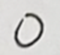
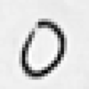

# **나의 해방일지**
 학기를 벗어나가며.. <br> <br>
 
## 파일 설명

### 코드파일
E02_1130.ipynb<br>
E02_1203.ipynb<br>
E02_1205.ipynb<br>
E02_1207.ipynb<br>
E02_1209.ipynb<br>
E02_1211.ipynb<br>
E02_1215.ipynb<br>
E02_1216.ipynb<br>
E02_1217.ipynb<br>
E02_1219.ipynb<br><br>
각 파일은 맨 위에 그 날짜에 했던 과정을 상세히 적어 놓은 글과 결론이 있다.<br>
11월 30일부터 12월 9일까지는 CNN을 이용하여 stage1, stage2을 달성하기 위한 노력이 담겨있다.<br>
12월 11일은 Fully Connected Network을 이용하여 stage1, stage2을 하는 과정이 있다.<br>
그리고 12월 15일부터 12월 19일까지 직접 손글씨를 stage1,2에서 만든 모델에 inference하는 과정이 담겨있다.(stage3)<br>
12월 16은 Fully Connected Network을 inference한 과정이 있다.
### 손글씨파일
E02_data <br>
E02_data 폴더 안에 test, test_change 폴더가 있다.<br><br>

test: 실제 손글씨 파일을 단순히 스캔해서 따온 이미지 파일이 담겨 있다.(각 숫자에 따라 폴더에 담았다.)<br><br>
test_change: test 폴더에 있는 사진을 pinetool을 이용하여, 검정색을 흰색으로 흰색을 검정색으로 바꾸었다.
<br>이유: stage1에서 모델을 학습할 때, MNIST 데이터를 사용하였는데, MNIST 데이터는 검정색 바탕에 흰색 글씨로 써져있다. 그러나 나의 손글씨 데이터는 흰색 바탕에 검정색 글씨이기 때문에 변환하는 과정이 필요했다.
### 손글씨 인증파일
original_picture 폴더 안에 손글씨 인증사진들이 담겨 있다.<br>
인증사진1<br>
인증사진2<br>
인증사진3<br>
인증사진4<br><br>
인증사진 파일은 직접 손글씨를 받은 사진이 담겨 있다.

## 11월 30일 <br>
Stage 1. 수업 시간에 배운 MNIST 데이터를 이용해서 손글씨 숫자 판별을 가능케 하는 딥러닝 모델 구축한다. <br>
Stage 2. stage1 에서 배운 MNIST 데이터를 test set에서 성능이 잘 나오는지 테스트해본다.<br>
### 과정:<br>

1.   Normalization은 median 값을 0.1307로, standard deviation을 0.3081로 통일하였다. (MNIST 데이터의 normalization은 일반적으로 다음과 같다고 알려져있다.)
2.   MNIST 데이터를 torchvision 패키지을 통해 불러오고, train, test set을 5:1의 비율로 나누었다. 그리고 train set과 validation set을 5:1로 나누었다.
3.   feature_extraction 파트는 convolution layer와 maxpooling layer을 섞어 총 9개의 layer을 찾았고, classifier 파트는 linear layer 2개를 처음과 끝에 붙이고 중간에 batchnormalization과 dropout을 사용하였다. 이때 batch size을 64로 맞추고 dropout은 0.5 파라미터를 사용하였다.
4.   Optimizier은 SGD을 사용하고, loss은 Cross-Entropy loss을 사용한다.
1.   epoch은 100으로 설정하였고, epoch이 증가함에 따라 train loss, validation loss, validation accuracy을 측정하였다.
2.   학습된 모델을 test set에 적용하여 accuracy을 측정하였다. : 91.95 %

<br> Accuracy가 91.95 %

## 12월 03일 <br>
Stage 1. 수업 시간에 배운 MNIST 데이터를 이용해서 손글씨 숫자 판별을 가능케 하는 딥러닝 모델 구축한다. <br>
Stage 2. stage1 에서 배운 MNIST 데이터를 test set에서 성능이 잘 나오는지 테스트해본다.<br>
### 과정:<br>
1. epoch을 70으로 줄이고, optimizer을 SGD을 Adam으로 바꾸었다.<br>

epoch 바꾼 이유: 11월 30일에 모델을 돌렸을 때, 50 이후로는 거의 accuracy의 변화가 없었고, Adam optimizer을 선택했을 때 optimal minimum으로 도달하는데까지 오래 걸릴 수 있었기 때문에 epoch을 넉넉하게 70으로 잡았다.<br>
optimizer 바꾼 이유: optimizer가 일반적으로 Adam이 더 성능이 좋다는 정보를 찾았기 때문에, optimizer을 바꾸었다.

<br> Accuracy: 91.53 %

## 12월 05일 <br>
Stage 1. 수업 시간에 배운 MNIST 데이터를 이용해서 손글씨 숫자 판별을 가능케 하는 딥러닝 모델 구축한다. <br>
Stage 2. stage1 에서 배운 MNIST 데이터를 test set에서 성능이 잘 나오는지 테스트해본다.<br>

1.   epoch을 35으로 줄였다.
2.   CNN 모델의 layer은 일정하게 유지하되, layer 안의 node 갯수에 변화를 주었다.

epoch은 30 이후로 accuracy가 크게 변하지 않았기 때문에 줄였고, CNN 모델 layer은 그대로 유지하되 layer안에 node의 갯수가 이전에 64로 통일되어있다는 문제를 식별하였다. 그래서 node갯수를 514, 256,128 등으로 변화를 주어 학습이 잘되도록 유도하였다.

<br> Accuracy: 92.13 %
<br> node의 개수를 변해도 크게 모델의 성능에 변화가 없었다.

<br> 결론: 지금껏 데이터 셋을 Fashion MNIST 데이터셋을 사용했기 때문에 생긴 문제라는 것을 포착하였다. 다음 시도 때는 숫자 데이터셋을 사용한 MNIST데이터셋으로 훈련 시켜보고자 한다.

## 12월 07일 <br>
Stage 1. 수업 시간에 배운 MNIST 데이터를 이용해서 손글씨 숫자 판별을 가능케 하는 딥 모델 구축한다. <br>
Stage 2. stage1 에서 배운 MNIST 데이터를 test set에서 성능이 잘 나오는지 테스트해본다.<br>

시도: 지금껏 FashionMNIST 데이터셋을 사용하여 accuracy을 높이는 것에 한계가 있었다. 그래서 이번 시도에서는 숫자 데이터가 담겨있는 MNIST 데이터셋으로 같은 모델에 훈련시켜본다.

결과 Accuracy가 99.53 이상이 나왔다.

## 12월 09일 <br>
stage 1: 12월 7일에 생성한 모델을 model_1209.pth 파일로 저장한다. 모델을 저장할 때, 가중치를 저장하는 방식을 선택하였다.

# 12월 11일 <br>
지금껏 CNN 모델을 이용하였는데, 문제에서 Fully Connected Network을 사용해야한다는 사실을 식별하였다. 
그래서 Fully connected Network을 만들고, CNN 모델과 성능을 비교해보고자 한다.
## 과정
1. Fully Connected Network은 총 4개 layer에 함수는 ReLU 함수를 사용하고, 각 layer을 통과할 때마다 batchnormalization을 거치게 하였다.
2. optimizer은 adam을 사용하였고, 총 epoch은 30을 사용하였다.

##결론 

CNN 모델보다 Accuracy가 낮지만 inference을 할 것이다.<br>
Accuracy: 98.24

## 12월 15일 <br>

Stage 3: inference<br><br>
첫째 작업: 나의 구글 드라이브에 있는 이미지를 불러와 testloader에 이미지와 라벨을 저장하였다.
<br><br>
발생된 문제 1: 데이터셋을 batch별로 나눌 때, 각 이미지의 사이즈가 같아야 하기 때문에, "stack expects each tensor to be equal size" 에러가 나왔다. 

문제 해결 방법 1: transform에서 transforms.Resize 코드를 추가하여 MNIST와 같은 사이즈 (28,28)로 변환하였다.
<br><br>
결론: 손글씨 데이터셋으로 평가해본 결과, 특정 숫자의 경우는 잘 맞추었지만 나머지 숫자에 있어서는 숫자 판별을 제대로 하지  못하였다.
<br>
Resize 코드를 넣기 전 원본 이미지<br>
<br>
Resize 코드를 넣기 후 이미지<br>


# 12월 16일 <br>

Stage 3: inference<br><br>
CNN 모델이 좋은 accuracy을 보여주지 못하여서, 
12월 9일날 만들었던 FCN 모델을 inference 해보았다.
<br><br>

결론: CNN 모델보다 더 숫자를 잘 맞추지 못하였다.

## 12월 17일 <br>

Stage 3: inference<br><br>
12월 15일 떄 식별된 문제: 특정 숫자의 일부는 accuracy가 좋았지만 나머지 데이터는 제대로 숫자를 판별하지도 못하였다. 

해결 방법: 
<br>
실제 데이터셋을 MNIST데이터와 비슷해지도록 data preprocessing 할 것이다. 
<br>MNIST 데이터는 검정색 바탕에 흰색 글씨가 써져 있는 반면, 나의 데이터셋은 흰색 바탕에 검정색 글씨이다. 그래서 이번에 실행할 data preprocessing은 색을 바꾸는 작업을 할 것이다.(검정색을 흰색으로, 흰색을 검정색으로)
<br><br>
검정색을 흰색으로, 흰색을 검정색을 바꾸기 위해서 웹사이트 pinetool을 이용하였다. Png 파일을 넣어서 흰색과 검정색을 바꾸는 기능을 수행한다.

웹사이트 주소: https://pinetools.com/invert-image-colors

<br><br>
결론: 
MNIST 데이터가 검정색 바탕에 흰 글씨이기때문에, 기존 데이터셋을 MNIST와 같은 형식으로 맞춰주었다. 그 결과 원래 숫자를 맞추지도 못했던 모델이 대부분의 숫자를 잘 맞추고 accuracy도 좋아진 것을 확인할 수 있었다.
<br>
색 변하기 전 이미지<br>
<br><br>
Pinetool을 통해 색을 변한 이미지<br>


## 12월 19일 <br>

Stage 3: inference<br><br>

12월 17일, 나는 모델이 내가 모은 데이터셋을 얼마나 잘 측정할 수 있는지 테스트를 해보았다. 그러나 각 숫자 별로 일부만 보여주었기 때문에,<br> 이번은 모든 데이터셋을 테스트해보았고 그 결과를 데이터프레임으로 정리하였다.


```python

```


```python

```
